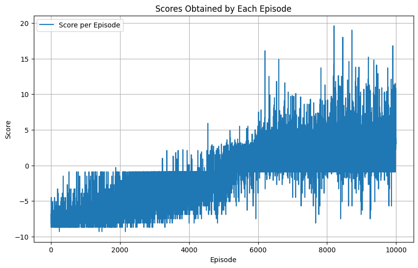

Vasilica Alexandru B4

# Assignement 5 Report

## Agent

The Q-Learning agent training is based on the 180 LIDAR sensor detections provided by the [environment](https://pypi.org/project/flappy-bird-gymnasium/). The agent uses a neural network with three hidden layers of 256, 128 and 32 neurons, respectively. The input layer has 180 neurons, one for each LIDAR sensor detection, and the output layer has two neurons, one for each action (flap and do nothing).

In order to improve convergence the following techniques were used:

- Experience replay using a replay buffer
- Episilon greedy exploration, with gradual decay of epsilon
- Using the Adam optimizer for parameter updates
- Xavier initialization for the weights of the neural network
- A target network which is updated every 100 steps for more stable training

In order to improve the training time, CUDA was used to train the neural network on the GPU.

## Training

The following hyperparameters were used for training:

```python
hyperparameters=Hyperparameters(
    gamma=0.9,
    epsilon=1.0,
    epsilon_min=0.01,
    epsilon_decay=0.00001,
    learning_rate=0.000025,
    batch_size=128,
    episodes=10_000,
    replay_buffer_capacity=50_000
)
```

The experiments conducted in order to improve the agent's performance lead to adding layer normalization, an Adam optimizer and increasing the replay buffer capacity to 50_000, which improved the convergence of the agent. Furthermore the gamma was chosen to be 0.9, as it was found to be a good trade-off between immediate and future rewards( other values which were tried were 0.8, 0.95, 0.99). Also multiple configurations for the hidden layers were tried, with the current configuration being the one which lead to the fastest convergence. The epsilon and epsilon decay were also adjusted until a good balance between exploration and exploitation was found. To improve the network's performance, layer normalization, dropout and batch normalization were tested, however, neither proved effective( probably due to the small action space).


## Results

The agent produces a maximum reward of 35 and an average reward of 9.1 over 100 validation episoades.

[Video demo](https://youtu.be/X5K9OgQFHvQ)


```csv
Episode: 1, Total Reward: 2.3999999999999986
Episode: 2, Total Reward: 6.7999999999999865
Episode: 3, Total Reward: 19.20000000000004
Episode: 4, Total Reward: 2.299999999999999
Episode: 5, Total Reward: 8.399999999999975
Episode: 6, Total Reward: 6.2999999999999865
Episode: 7, Total Reward: 27.000000000000135
Episode: 8, Total Reward: 10.599999999999977
Episode: 9, Total Reward: 17.90000000000001
Episode: 10, Total Reward: 34.70000000000021
Episode: 11, Total Reward: 1.300000000000002
Episode: 12, Total Reward: 28.90000000000016
Episode: 13, Total Reward: 19.600000000000072
Episode: 14, Total Reward: 1.300000000000002
Episode: 15, Total Reward: 5.399999999999989
Episode: 16, Total Reward: 19.200000000000035
Episode: 17, Total Reward: 6.499999999999986
Episode: 18, Total Reward: 5.499999999999988
Episode: 19, Total Reward: 7.599999999999982
Episode: 20, Total Reward: 2.299999999999999
Episode: 21, Total Reward: 4.699999999999987
Episode: 22, Total Reward: 6.2999999999999865
Episode: 23, Total Reward: 7.499999999999975
Episode: 24, Total Reward: 12.399999999999961
Episode: 25, Total Reward: 2.299999999999999
Episode: 26, Total Reward: 6.899999999999986
Episode: 27, Total Reward: 1.300000000000002
Episode: 28, Total Reward: 10.099999999999977
Episode: 29, Total Reward: 0.5000000000000027
Episode: 30, Total Reward: 26.80000000000014
Episode: 31, Total Reward: 2.299999999999999
Episode: 32, Total Reward: 10.799999999999976
Episode: 33, Total Reward: 17.90000000000001
Episode: 34, Total Reward: 6.399999999999986
Episode: 35, Total Reward: 6.999999999999984
Episode: 36, Total Reward: 2.9999999999999982
Episode: 37, Total Reward: 8.499999999999975
Episode: 38, Total Reward: 6.2999999999999865
Episode: 39, Total Reward: 10.699999999999974
Episode: 40, Total Reward: 1.300000000000002
Episode: 41, Total Reward: 10.099999999999975
Episode: 42, Total Reward: 13.999999999999961
Episode: 43, Total Reward: 18.900000000000077
Episode: 44, Total Reward: 6.7999999999999865
Episode: 45, Total Reward: 6.199999999999987
Episode: 46, Total Reward: 2.299999999999999
Episode: 47, Total Reward: 10.199999999999976
Episode: 48, Total Reward: 17.099999999999984
Episode: 49, Total Reward: 17.000000000000025
Episode: 50, Total Reward: 1.300000000000002
Episode: 51, Total Reward: 6.899999999999986
Episode: 52, Total Reward: 6.2999999999999865
Episode: 53, Total Reward: 5.599999999999987
Episode: 54, Total Reward: 1.300000000000002
Episode: 55, Total Reward: 2.299999999999999
Episode: 56, Total Reward: 10.799999999999974
Episode: 57, Total Reward: 15.79999999999999
Episode: 58, Total Reward: 7.099999999999985
Episode: 59, Total Reward: 8.399999999999975
Episode: 60, Total Reward: 21.900000000000084
Episode: 61, Total Reward: 6.2999999999999865
Episode: 62, Total Reward: 0.4000000000000026
Episode: 63, Total Reward: 2.299999999999999
Episode: 64, Total Reward: 10.299999999999974
Episode: 65, Total Reward: 5.2999999999999865
Episode: 66, Total Reward: 10.199999999999974
Episode: 67, Total Reward: 1.300000000000002
Episode: 68, Total Reward: 16.199999999999996
Episode: 69, Total Reward: 2.299999999999999
Episode: 70, Total Reward: 6.2999999999999865
Episode: 71, Total Reward: 2.6645352591003757e-15
Episode: 72, Total Reward: 6.899999999999986
Episode: 73, Total Reward: 0.800000000000002
Episode: 74, Total Reward: 10.899999999999974
Episode: 75, Total Reward: 8.499999999999975
Episode: 76, Total Reward: 30.40000000000022
Episode: 77, Total Reward: 14.799999999999983
Episode: 78, Total Reward: 18.80000000000004
Episode: 79, Total Reward: 8.999999999999975
Episode: 80, Total Reward: 0.800000000000002
Episode: 81, Total Reward: 31.70000000000023
Episode: 82, Total Reward: 10.799999999999974
Episode: 83, Total Reward: 2.299999999999999
Episode: 84, Total Reward: 6.399999999999986
Episode: 85, Total Reward: 2.3999999999999986
Episode: 86, Total Reward: 9.099999999999982
Episode: 87, Total Reward: 26.80000000000012
Episode: 88, Total Reward: 6.899999999999986
Episode: 89, Total Reward: 2.1000000000000014
Episode: 90, Total Reward: 10.999999999999963
Episode: 91, Total Reward: 10.299999999999976
Episode: 92, Total Reward: 6.399999999999986
Episode: 93, Total Reward: 10.399999999999968
Episode: 94, Total Reward: 18.400000000000038
Episode: 95, Total Reward: 2.3999999999999986
Episode: 96, Total Reward: 7.499999999999975
Episode: 97, Total Reward: 18.000000000000018
Episode: 98, Total Reward: 5.899999999999986
Episode: 99, Total Reward: 6.2999999999999865
Episode: 100, Total Reward: 0.800000000000002

```
